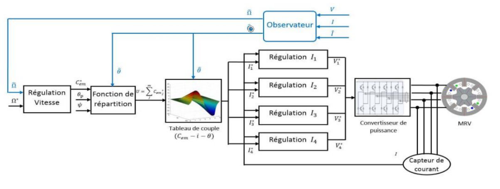

# Engineering Graduation Project : Reluctance motor synthesis, Sliding Mode and Kalman Filter observers, Fault Tolerant Control command

This project is my **Graduation Project** as a 5th Year **Engineering student at ESTACA**. Me and my team worked on this projet for 4 months during or last engineering year and this was our main grade for this year toward graduation.

## Abstract

A **reluctance motor** is a type of electric motor that induces non-permanent magnetic poles on the ferromagnetic rotor. The rotor does not have any windings. It generates torque through magnetic reluctance. Reluctance motors can deliver high power density at low cost, making them attractive for many applications. Until the early twenty-first century, their use was limited by the complexity of designing and controlling them. Advances in theory, computer design tools, and low-cost embedded systems for control overcame these obstacles.

The goal of our graduation project was then to take the reluctance motor as a use case for a complete **synthesis of a control command without sensor**. For these, we had to refer to our theoretical knowledge upon robust and optimal commad, observers usage to replace sensors and general knwoledge on control command scaling. We benchmarked two main observer : **Sliding Mode** and **Kalman Filter** to recreate position sensor.

To go further on those observers, we implemented a **Fault Tolerant Control** command to watch for our observers state and raise error to user if needed using several check routine and an algorithm to detect observers degradations.

## Table of contents

### 1. Introduction

### 2. The Reluctance motor

- **2.1  Use case context**
- **2.2  Reluctance motor functioning**
- **2.3  Reluctance motor functioning without sensor : Observer addition**

### 3. Replacing sensor by observers

- **3.1  Sliding Mode observer**
	- 3.1.1  Therory
	- 3.1.2  Sliding mode observer equation for position sensor
	- 3.1.3  Simulink implementation for the reluctance motor *PI/SM* *(Proportinal-Integral / Sliding Mode)*
	- 3.1.4  Robustness test for *PI/SM*
	- 3.1.5  Simulink implementation for the reluctance motor *SM/SM*
	- 3.1.6  Robustness test for *SM/SM*

- **3.2 Kalman filter**
	- 3.2.1  Therory
	- 3.2.2  Kalman filter method equation for position sensor
	- 3.2.3  Implementation
	- 3.2.4  Robustness test

- **3.3 Observers comparison**

### 4. Fault Tolerant Control command

- **4.1  FTC Command objectives**

- **4.2  FTC command synthesis for a reluctance motor with observers**
	- 4.2.1  Check for observers block output datas refreshing
	- 4.2.2  Check for "Out of Range" output
	- 4.2.3  Watch for large fluctuation in observers output signals
	- 4.2.4  Vote algorithm to detect observers degradations
	- 4.2.5  Raising failure for user

### 5. Conclusion

### 6. Project Management feedback

## Reluctance Motor Model

## Credits

This work was done with my former school colleagues :

- **Antoine HAMY**
- **Cindy MALARD**
- **Paul MUGNIER**

And our teachers help, **Dr. Ahmed CHAIBET** and ***Dr. Moussa BOUKNIFER**,
